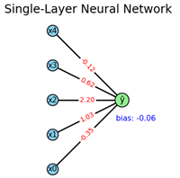
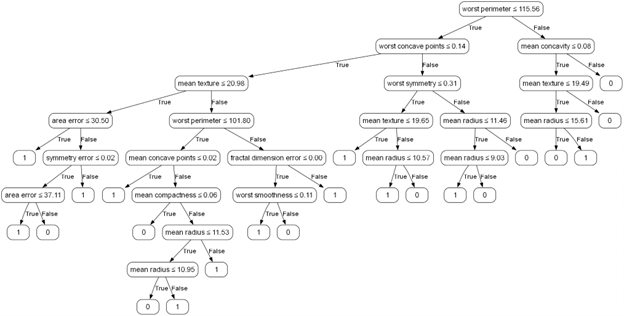

# 🧠📊 Neural Network vs Decision Tree

This project compares two classic machine learning models:

* A **single-layer neural network** trained with gradient descent
* The **ID3 decision tree algorithm** based on information gain

We tested them on the **Wisconsin Breast Cancer Dataset** to see which one performs better and why.

---

## 📂 Files

| File                | Description                                                |
| ------------------- | ---------------------------------------------------------- |
| `neural_network.py` | Neural network implementation, training, and visualization |
| `ID3_alg.py`        | ID3 decision tree with visualization using Graphviz        |
| `compare_models.py` | Loads data and compares both models on accuracy            |
| `PA_SML.pdf`        | Full project report with explanations and results          |

---

## 🧪 Dataset

We used the [Breast Cancer dataset](https://scikit-learn.org/stable/modules/generated/sklearn.datasets.load_breast_cancer.html) from scikit-learn.

* 30 features
* Binary classification (malignant or benign)
* Split: 80% training / 20% test

---

## 📈 Results Summary

| Model          | Train Accuracy | Test Accuracy |
| -------------- | -------------- | ------------- |
| Neural Network | \~99.0%        | \~97.0%       |
| ID3 Tree       | 100%           | \~93.0%       |

---

## 🖼 Visual Examples

### 🧠 Neural Network Diagram

  

### 🌳 Decision Tree Structure

  

---

## 📌 What We Learned

* Neural networks give better accuracy but need careful tuning (learning rate, epochs).
* Decision trees are easier to understand and faster to train but can overfit.
* Visualizing both models helped us understand their decisions better.

---

## 👥 Authors

* Nitzan Monfred
* Nicole Frumkin
* Alona Gertskin
